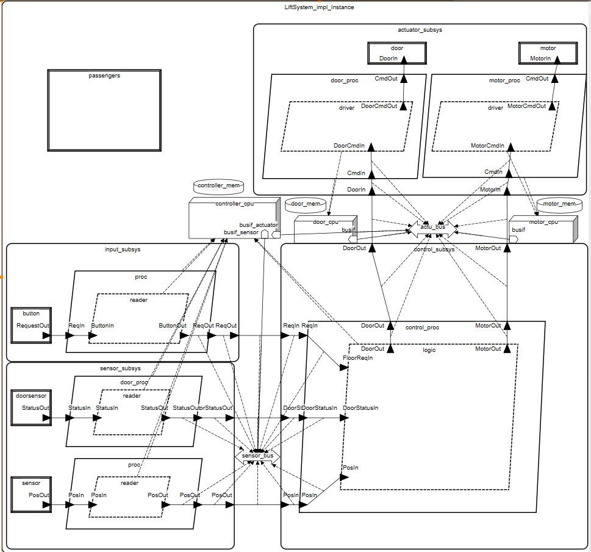

# Winda jednokabinowa

## Opis
Model **systemu windy jednokabinowej** w **AADL**.  
Modelowana jest i warstwa logiczna i fizyczna

---

---

## Struktura
Model podzielony jest na następujące główne komponenty:

### 1. **Dane i typy**
- `FloorRequestType`, `PositionType`, `DoorStatusType` – reprezentacja danych z sensorów.
- `MotorCommandType`, `DoorCommandType` – komendy.
- Własności SEI:  
  - `SEI::GrossWeight` – aktualna masa kabiny.  
  - `SEI::WeightLimit` – maksymalne dozwolone obciążenie.  
  - `PowerCapacity`, `PowerBudget`, `PowerSupply` – właściwości dostępnej i użytej energii.  

### 2. **Urządzenia (devices)**
- `FloorButton` – przyciski. 
- `PositionSensor` – sensor położenia kabiny.  
- `DoorSensor` – czujnik stanu drzwi.  
- `Motor` – napęd windy.  
- `Door` – drzwi z aktuatorem
- `DummyPassengers` – symuluje obciążenie.

### 3. **Procesy i wątki**
- Procesy: `ButtonProcess`, `PositionProcess`, `DoorSensorProcess`, `ControlProcess`, `MotorProcess` i `DoorProcess`.  
- Wątki: `ButtonReader`, `PositionReader`, `DoorSensorReader`, `ControllerLogic`, `MotorDriver` i `DoorDriver`.  

### 4. **Subsystemy**
- `InputSubsystem` – obsługa przycisków.  
- `SensorSubsystem` – obsługa sensorów w drzwiach.
- `ControlSubsystem` – logika sterowania.  
- `ActuatorSubsystem` – sterowanie silnikiem i drzwiami.  

### 5. **Sprzęt**
- `lift_cpu_dual` – główny kontroler z dwoma interfejsami magistrali.  
- `motor_mcu`, `door_mcu` – dedykowane procesory do obsługi aktuatorów.  
- `main_ram`, `motor_ram`, `door_ram` – pamięci lokalne.  
- `sensor_bus`, `actuator_bus` – oddzielne magistrale dla ruchu czujników i aktuatorów.  

---

## Modelowanie fizyczne
Komponenty gdzie jest to aplikowalne, mają modelowaną masę, oraz energię

---

## Analizy
Zostały wykonane analizy energii oraz mas

---
